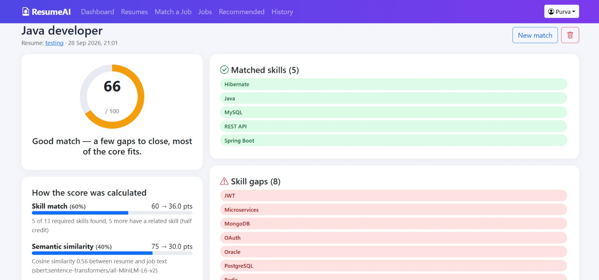
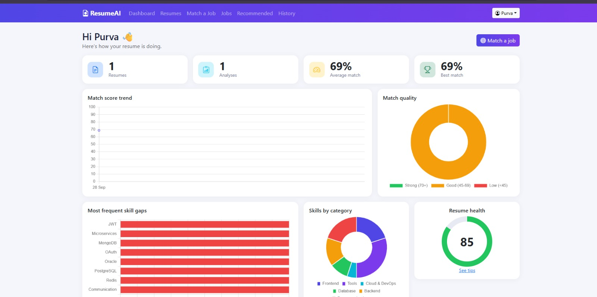
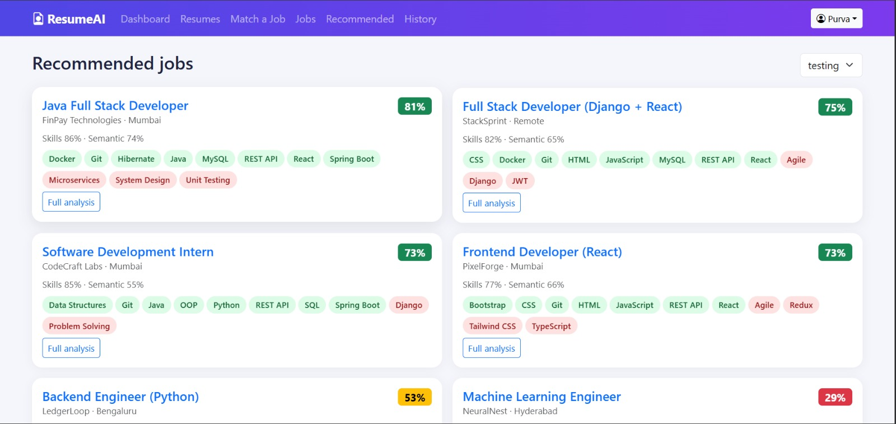
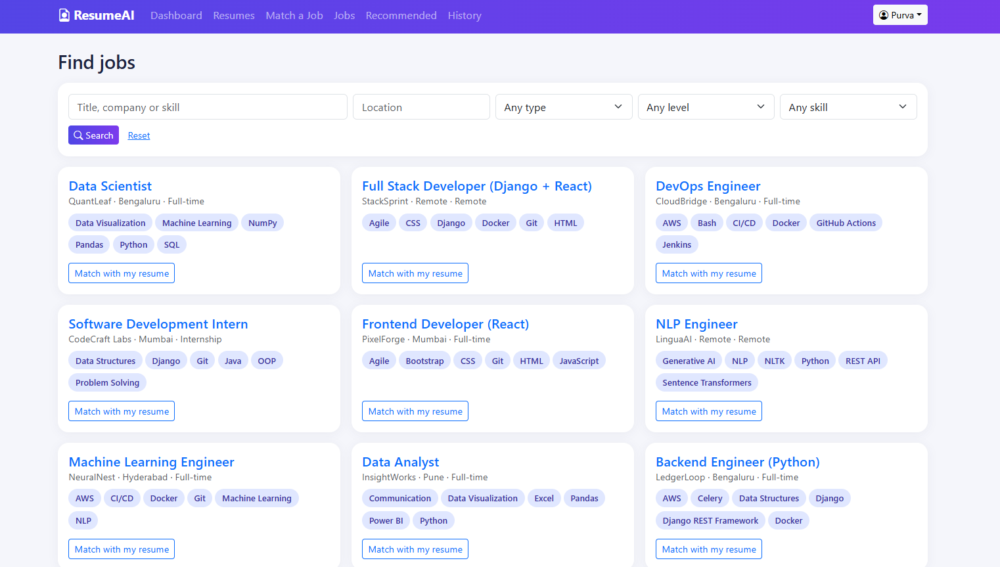

# AI Resume Analyzer & Job Matcher

Python-only stack: **Django + MySQL**, Bootstrap 5 / Chart.js frontend, and an in-process AI layer
(`ai_engine/`) using spaCy, scikit-learn, Pandas, NumPy, Sentence Transformers, pypdf and python-docx.

## 🎥 Project 
## 📸 Screenshots

<table>
  <tr>
    <td align="center">
      <br>
      <b>Dashboard</b>
    </td>
    <td align="center">
      <br>
      <b>Resume Analysis</b>
    </td>
  </tr>
  <tr>
    <td align="center">
      <br>
      <b>job recommendation</b>
    </td>
    <td align="center">
      <br>
      <b>Job Matching</b>
    </td>
  </tr>
</table>


## Quick start
```bash
python -m venv .venv && source .venv/bin/activate      # Windows: .venv\Scripts\activate
pip install -r requirements.txt
python -m spacy download en_core_web_sm                # optional: better name extraction
cp .env.example .env                                   # then edit DB_* values

# MySQL
mysql -u root -p -e "CREATE DATABASE resume_ai CHARACTER SET utf8mb4 COLLATE utf8mb4_unicode_ci;"

python manage.py migrate
python manage.py seed_data          # ~100 skills, related-skill graph, 10 sample jobs
python manage.py createsuperuser
python manage.py runserver
```
No MySQL handy? Set `USE_SQLITE=1` in `.env` for a quick local run. Run tests: `python manage.py test`.

## Project layout
| Path | Purpose |
|---|---|
| `accounts/` | Register / login / profile (Django auth) |
| `resumes/` | Secure upload (extension + size + magic-byte checks, random file names, owner-only download), parsed resume storage |
| `jobs/` | `Skill` + `Job` models, job search, recommendations, admin (CSV skill import, auto-detect skills) |
| `analysis/` | Resume-vs-JD analyses, history, result page |
| `dashboard/` | Stats and charts (Pandas + Chart.js) |
| `ai_engine/` | `text_extraction`, `skills`, `parser`, `embeddings`, `matcher`, `recommender`, `suggestions` |

## How the score works (0-100)
`final = 0.6 x skill_score + 0.4 x semantic_score`
* **Skill score** – weighted share of the job's required skills found in the resume. A missing skill with a related one on the
  resume (e.g. PostgreSQL vs MySQL) earns **half credit**. Skills repeated in the JD weigh up to 1.5x.
* **Semantic score** – cosine similarity of Sentence-Transformer embeddings (`all-MiniLM-L6-v2`), long texts are chunked and
  mean-pooled, then calibrated to 0-100.
* If the JD has no recognisable skills, only semantic similarity is used.
* The result page shows both parts, matched / missing / related skills and a plain-language explanation.

**Honesty rule:** suggestions never add skills or numbers. For a missing skill they say "add it only if you really have it,
otherwise treat it as a learning goal".

## Notes
* First run downloads the embedding model (needs internet once). If it can't load, the app automatically falls back to hashed
  TF-IDF vectors so everything keeps working (the result page shows which backend was used).
* Scanned/image-only PDFs are rejected with a clear message (no OCR).
* Admin panel (`/admin/`): manage jobs, skills (with aliases, related skills, CSV import), resumes, analyses.
* For production: set `DJANGO_DEBUG=0`, a real `DJANGO_SECRET_KEY`, and serve behind HTTPS.
